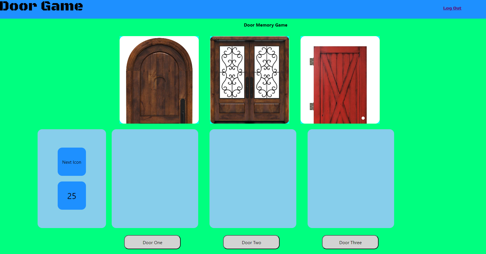

# Project_02

## Table of Contents

1.[Description](#Description) 
2.[Installation Instructions](#Installation-Instructions) 
3.[Usage Information](#Usage-Information) 
4.[Contribution Guidelines](#Contribution-Guidelines) 
5.[Test Instructions](#Test-Instructions) 
6.[License](#License) 
7.[Screenshots](#Screenshots) 
8.[Questions](#Questions) 
    ----> 1a.[GitHub User Name](#Github-User-Name) 
    ----> 2a.[Email](#Email) 
    ----> 3a.[Deployed Link](#Deployed-Link) 

## Description 

This is a template for creating a full stack application that has a database, a login, a sign up  and a game with a logout feature.

## Installation Instructions

You will need to install mysql2, express and express-session with node package manager.

## Usage Information

For learning how to develop a very basic full stack application.

## Contribution Guidelines

This is a solo mission.

## Test Instructions

If you find any bugs go ahead and meet me at the corner of here and there and send smoke signals after rubbing two hurricane tall cans together and I will appear from a portal.

## License

MIT License
(https://opensource.org/licenses/MIT)

## Screenshots

## Questions

### Github User Name

algorithmnblues92

### Email

algorithmnblues92@gmail.com

### Deployed Link:

https://algorithmnblues92.github.io/project_02/